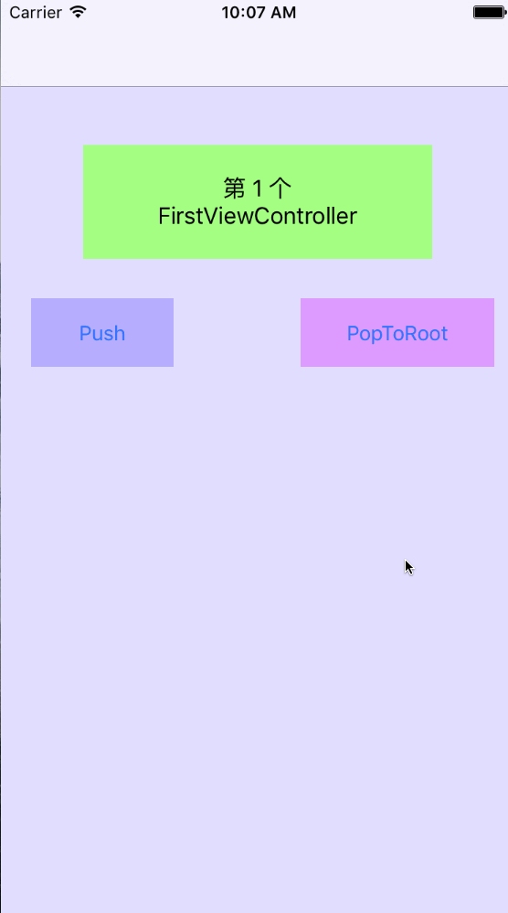

# PanPush_NavigationController
为UINavigationController添加右滑Pop、左滑Push出ViewController的功能,集成非常简单.
<br>

### 1.How to use
```
使用or继承Demo中提供的`PanNavigationController`即可
```
<br>

### 2.右滑Pop返回
因为右滑返回功能是默认开启的，如果需要在某一个页面关闭，需要在此`Controller`的生命周期方法中设置，但因为`UINavigationController`是全局的，所以在此`Controller`消失的时候再设置打开，因为其他`Controller`很有可能会使用此功能(用户亦可根据自己的使用场景设置开启or关闭时机)

```
//关闭右滑返回功能
- (void)viewWillAppear:(BOOL)animated
{
    [super viewWillAppear:animated];
    PanNavigationController *nav = (PanNavigationController *)self.navigationController;
    nav.isForbidDragBack = YES;
}

//开启右滑返回功能
- (void)viewWillDisappear:(BOOL)animated
{
    [super viewWillDisappear:animated];
    PanNavigationController *nav = (PanNavigationController *)self.navigationController;
    nav.isForbidDragBack = NO;
}

```
<br>

### 3.左滑Push
此功能是参照`网易新闻App`在`新闻详情`页，左滑push出`评论列表`页面的实现方式.

因为在`UINavigationController `导航堆栈中，我们根本不知道即将push的是哪一个新的`Controller`,so,在某个`Controler`中要使用此功能时,必须设置`delegate`,并实现其代理方法,设置左滑push出的新的`Controller`.(用户亦可根据自己的使用场景设置开启or关闭时机)

```
@interface SecondViewController ()<PanPushToNextViewControllerDelegate>

```

既然`UINavigationController`是全局的，所以在此`Controller`消失的时候需要关闭此功能

```
//开启左滑push功能，设置代理，实现其代理方法
- (void)viewDidAppear:(BOOL)animated
{
    [super viewDidAppear:animated];
    PanNavigationController *nav = (PanNavigationController *)self.navigationController;
    [nav setNextViewControllerDelegate:self];
}

//关闭左滑push
- (void)viewWillDisappear:(BOOL)animated
{
    [super viewWillDisappear:animated];
    PanNavigationController *nav = (PanNavigationController *)self.navigationController;
    [nav setNextViewControllerDelegate:nil];
}

```

指定通过左滑push功能推出的新的Controller

```
#pragma mark -- PanSwiper Delegate --
- (UIViewController *)swiperBeginPanPushToNextController:(PanSwiper *)swiper
{
    FirstViewController *controller = [[FirstViewController alloc] initWithNibName:NSStringFromClass([FirstViewController class]) bundle:nil];
    return controller;
}
```
<br>


